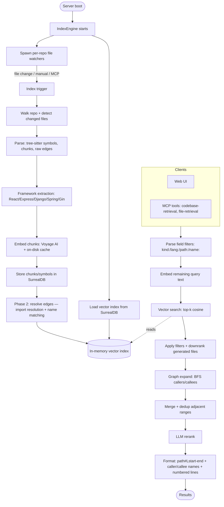

# context-engine

**English** · [Tiếng Việt](README-vi.md) · [中文](README-zh.md)


## Install & Run

Run the latest release directly with npx — no manual download, the correct
prebuilt binary for your platform is fetched automatically. The `@latest`
tag forces npx to fetch the newest published version instead of reusing a
stale cached one:

```bash
npx context-engine@latest
```

This boots the HTTP server on port 6699 (web UI at http://127.0.0.1:6699,
MCP endpoint at `/mcp`). Any CLI flags are forwarded to the binary:

```bash
npx context-engine@latest --port 8080 --bind 0.0.0.0
```

Or install it globally to get a persistent `context-engine` command:

```bash
npm install -g context-engine@latest
context-engine --port 6699
```

Supported platforms: Linux x64/arm64, macOS arm64, Windows x64.

## Using a 9Router (OpenAI-compatible) embedding endpoint

context-engine can embed through any OpenAI-compatible `/v1/embeddings`
endpoint, including a local [9Router](https://github.com/decolua/9router)
gateway. **No code change is needed** — only settings. This lets you run
embeddings on your own hardware (e.g. a self-hosted Ollama model on a GPU box)
while keeping the cloud Voyage/OpenAI defaults untouched.

The chain looks like this:

```
context-engine ──▶ 9Router /v1/embeddings ──▶ embedding provider node
                                          (built-in OR custom-embedding)
                                              │
                                              ▼
                       any OpenAI-compatible backend (Ollama, vLLM, LM Studio,
                       OpenAI, Voyage, Jina, Mistral, …)
```

### 1. Point context-engine at 9Router

Open the web UI (http://127.0.0.1:6699), go to **Embedding Provider**, and set:

| Field | Value |
|-------|-------|
| Provider | `OpenAI` |
| Base URL | `http://localhost:20128/v1` |
| Embedding model | the 9Router model string, e.g. `emb/bge-m3` (`<node-prefix>/<model>`) |
| API key | a key from the 9Router dashboard if 9Router has `requireApiKey` enabled; otherwise any non-empty dummy value |
| Output dimensions | the model's native dimension (e.g. `1024` for `bge-m3`, `768` for `nomic-embed-text`); leave blank to use the model default |

How the request is built:

- The code appends `/embeddings` itself, so the Base URL must be the **base**
  form `http://localhost:20128/v1`, **not** `…/v1/embeddings` (it accepts the
  full form too and won't double-append, but the base form is the convention).
  The resulting request is `POST http://localhost:20128/v1/embeddings` with a
  `Bearer` auth header and body `{ "model": ..., "input": [...] }`, and the
  response is parsed as `{ "data": [{ "embedding": [...] }] }`.
- The model must be an **embedding** model, not a chat model. In 9Router this
  is a `custom-embedding` provider node whose `prefix` you prepend to the model
  name (`<prefix>/<model>`).
- At least one API key is required (the client refuses to start with none). If
  9Router does not require a key, paste any placeholder such as `local`.

### 2. Configure the embedding node in 9Router

In the 9Router dashboard (http://localhost:20128/dashboard):

1. Go to **Media Providers → Embedding**.
2. Click **+ Add Custom Embedding** and fill in:
   - **Name**: any label, e.g. `Ollama bge-m3`
   - **Prefix**: the prefix you reference from context-engine, e.g. `emb`
   - **Base URL**: the backend's OpenAI-compatible base, e.g.
     `http://localhost:11434/v1` for a local/tunnelled Ollama
3. Add **one API key/connection** to the node (9Router requires at least one
   active connection even when the backend ignores it — for Ollama any dummy
   value like `ollama` works).
4. Optionally **Validate** with a model id (e.g. `bge-m3`) — a healthy node
   reports `Valid · <N> dims`.

The model you reference from context-engine is then `<prefix>/<model>`, e.g.
`emb/bge-m3`.

### 3. (Optional) Self-hosted Ollama backend on a GPU box

If the embedding backend (Ollama) runs on a **different machine** than 9Router,
bridge it with an SSH local port-forward so 9Router can reach it on
`localhost`:

```bash
# On the machine running 9Router. Forwards localhost:11434 → server's Ollama.
ssh -N -L 11434:localhost:11434 <user>@<server-host> -p <port>
```

On the server, pull and serve the model once:

```bash
ollama pull bge-m3          # 1024-dim, multilingual (good for non-English code/comments)
# ollama pull nomic-embed-text   # 768-dim, lighter alternative
```

> The tunnel must stay open for embeddings to work. For a durable setup, run it
> as a service (systemd / Task Scheduler) or expose Ollama directly on the
> network — but note an unauthenticated Ollama bound to a public interface is a
> security risk; prefer the tunnel or a firewall rule.

### 4. Verify end-to-end

```bash
curl -s http://localhost:20128/v1/embeddings \
  -H "Authorization: Bearer <your-9router-key>" \
  -H "Content-Type: application/json" \
  -d '{"model":"emb/bge-m3","input":["hello from context-engine"]}'
```

A healthy response is `{"object":"list","data":[{"embedding":[…1024 floats…]}]}`.
Then add a repo in the context-engine UI and run a test query — semantically
related files should rank above unrelated ones.

> ⚠️ **Re-index on model/dimension change.** Changing the embedding model or
> output dimension changes the vector space, so existing vectors become
> incompatible. Delete and re-index every repo after such a change. The Voyage
> and OpenAI cloud defaults are unchanged; leaving Base URL blank uses the
> provider's official endpoint exactly as before.

## Integrating into a chat session (MCP)

context-engine exposes its retrieval as an **MCP server over streamable HTTP**,
so coding agents can call it mid-conversation instead of blindly reading files.
Two tools are published:

| Tool | What it does |
|------|--------------|
| `codebase-retrieval` | Semantic + graph search across an indexed repo. Ask in natural language ("where is auth handled?") and get ranked code with caller/callee context. |
| `file-retrieval` | Given a file and a description, returns only the relevant line ranges instead of the whole file. |

### Auto-setup (recommended)

In the web UI, open the **MCP** panel, pick your agent tab (**Claude Code**,
**Codex**, or **Opencode**), and click **Auto Setup** for the repo. This writes
the right config + prompt files directly into the repo (atomic, idempotent,
never clobbers unrelated keys):

| Agent | Files written |
|-------|---------------|
| Claude Code | `.mcp.json` (server entry), `.claude/settings.local.json` (`enableAllProjectMcpServers: true`, git-ignored), `CLAUDE.md` (usage guidance) |
| Codex | `.codex/config.toml` (server entry), `AGENTS.md` (usage guidance) |
| Opencode | `opencode.json` (server entry), `AGENTS.md` (usage guidance) |

### Manual setup

If you prefer to wire it yourself, point your agent at the per-repo MCP URL:

```
http://127.0.0.1:6699/mcp-repo/<sanitized-repo-path>
```

For Claude Code, the `.mcp.json` entry looks like:

```json
{
  "mcpServers": {
    "codebase-retrieval": {
      "type": "http",
      "url": "http://127.0.0.1:6699/mcp-repo/<sanitized-repo-path>"
    }
  }
}
```

Add a line to your agent's prompt file (`CLAUDE.md` / `AGENTS.md`) so the agent
prefers the tool:

> When asked about the codebase, project structure, or to find code, always use
> the context-engine MCP tool (`codebase-retrieval`) in the root workspace
> first before reading individual files. When you need a specific file but
> don't know the exact line range, use `file-retrieval` instead of reading the
> whole file.

Because embeddings flow through the same configured provider, an agent in a
chat session searching your code is — in the 9Router setup above — querying
your self-hosted bge-m3 model on the GPU box, end to end.

## Features

| Feature | Description |
|---------|-------------|
| Semantic code search | Finds code by meaning via embeddings, not literal text matching |
| Multi-language parsing | Tree-sitter symbol extraction for 22 languages (see table below) |
| Call-graph expansion | Resolves caller/callee edges and BFS-expands matched symbols at query time |
| Import-path resolution | Traces imports to actual files for TS/JS, Python, Go, and Rust — resolves cross-module calls that name matching misses |
| Framework-aware resolution | Detects React, Express, Django, Spring, Go Gin and produces routing/DI/rendering edges automatically |
| Generated-file detection | Downranks protobuf stubs, gRPC scaffolding, mocks, and codegen outputs so hand-written code surfaces first |
| Field-qualified search | Filter results with `kind:function`, `lang:rust`, `path:src/api`, `name:Handler` prefixes in queries |
| Enriched caller/callee output | MCP results show symbol names `[callers: fn_a, fn_b +N more]` instead of bare counts |
| Incremental indexing | Re-indexes only changed files (mtime + watcher), crash-safe via per-file commit markers |
| Real-time file watching | `notify` (debounced) triggers re-index automatically on file changes |
| Voyage AI embeddings | HTTP embedding client with an on-disk cache to avoid redundant API calls |
| LLM reranking | Reorders candidate chunks with an LLM (OpenAI / Google); optional, can be disabled |
| Embedded SurrealDB | Stores chunks, symbols, and edges; one datastore per repo |
| HTTP API + Web UI | Settings management, index explorer, and a query test console |
| MCP server | Exposes `codebase-retrieval` and `file-retrieval` tools over streamable HTTP |
| SSE progress stream | Streams live indexing progress events to the UI |
| Large-repo scaling | Bounded memory and no O(n²) paths — built for Linux/Chromium-scale codebases |

## Supported Languages

Tree-sitter symbol extraction (functions, classes, methods, and call edges) is
implemented per language. File extensions are mapped in `detect_language`
(`src/parsing/mod.rs`).

| Language | Extensions | Grammar |
|----------|------------|---------|
| Python | `.py` | `tree-sitter-python` |
| JavaScript | `.js`, `.jsx`, `.mjs`, `.cjs` | `tree-sitter-javascript` |
| TypeScript | `.ts` | `tree-sitter-typescript` |
| TSX | `.tsx` | `tree-sitter-javascript` |
| Rust | `.rs` | `tree-sitter-rust` |
| Go | `.go` | `tree-sitter-go` |
| Java | `.java` | `tree-sitter-java` |
| C | `.c` | `tree-sitter-c` |
| C++ | `.cpp`, `.cc`, `.cxx`, `.h`, `.hpp`, `.hxx`, `.hh` | `tree-sitter-cpp` |
| C# | `.cs` | `tree-sitter-c-sharp` |
| PHP | `.php` | `tree-sitter-php` |
| Ruby | `.rb` | `tree-sitter-ruby` |
| Objective-C | `.m`, `.mm` | `tree-sitter-objc` |
| Swift | `.swift` | `tree-sitter-swift` |
| Kotlin | `.kt`, `.kts` | `tree-sitter-kotlin` |
| Dart | `.dart` | `tree-sitter-dart` |
| Lua | `.lua` | `tree-sitter-lua` |
| Luau | `.luau` | `tree-sitter-luau` |
| Svelte | `.svelte` | `tree-sitter-javascript` (script block) |
| Pascal | `.pas`, `.pp`, `.dpr`, `.lpr`, `.dpk` | `tree-sitter-pascal` |
| Liquid | `.liquid` | `tree-sitter-liquid` |

Files with any other extension are chunked and embedded for semantic search,
but no symbols or call edges are extracted from them.

## How It Works



## Contributing

We welcome **feature requests described in prose** — open an issue describing the
behavior you'd like to see, and we'll consider it for the roadmap.

At this time we are **not accepting pull requests that contain code**, with the
**sole exception of bug fixes**. If you'd like to propose a new feature, please
file a feature-request issue rather than a code PR. Bug-fix PRs (with a clear
description of the bug and the fix) are welcome.
